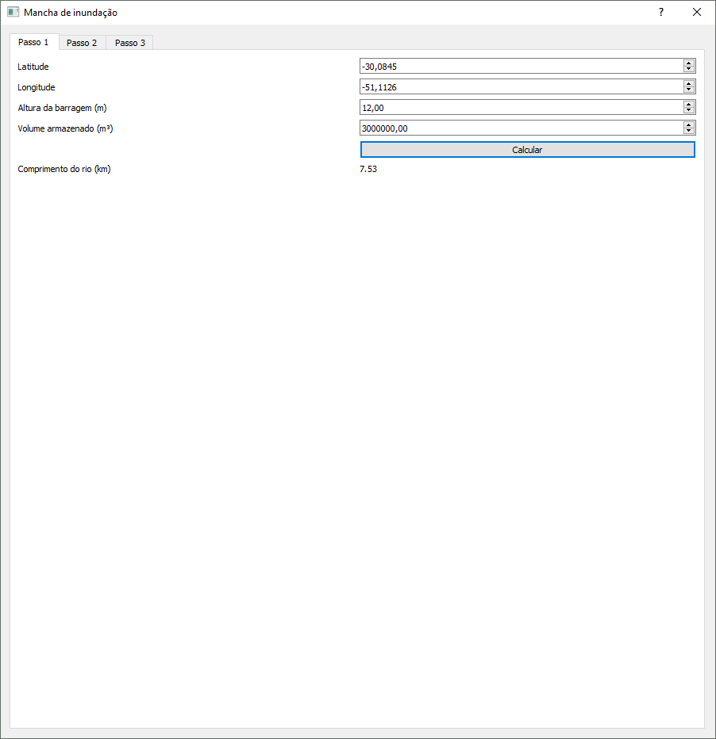
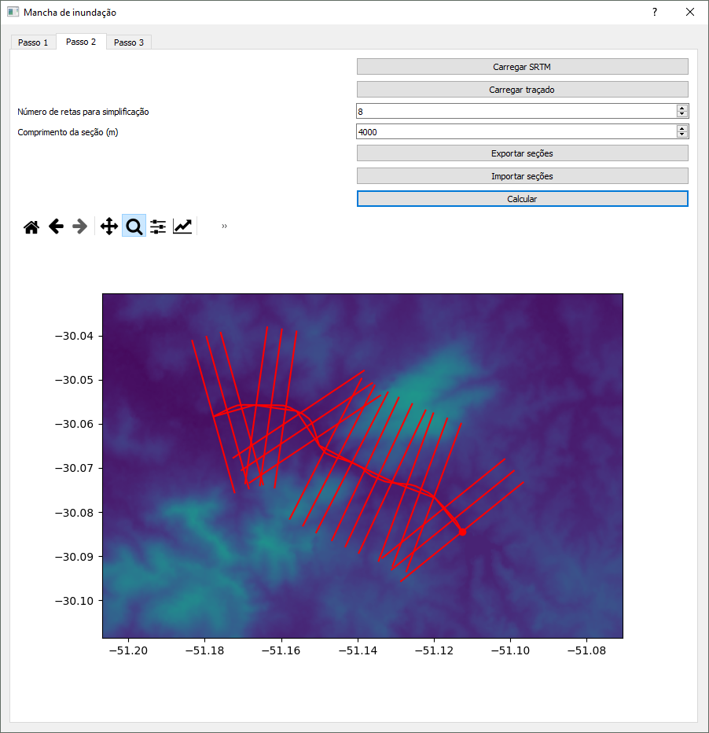
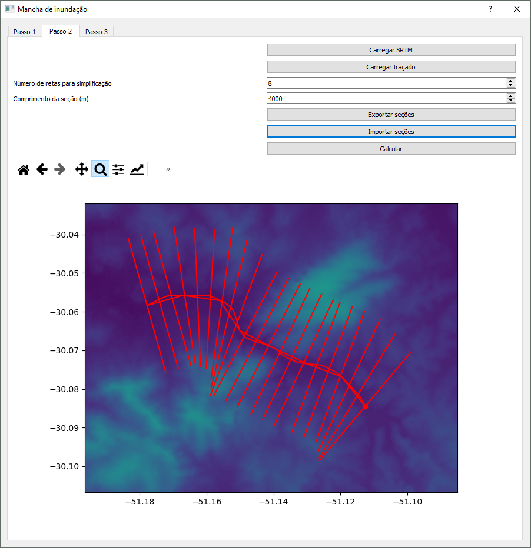
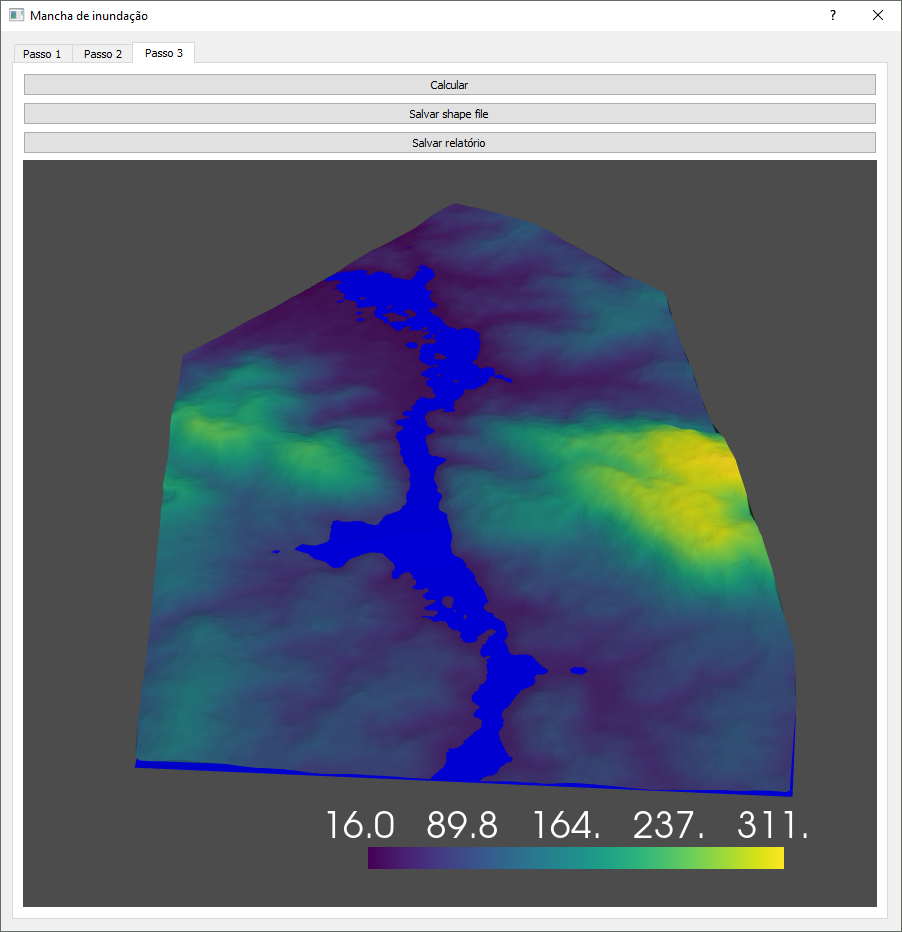

# Mancha de Inundação

Implementação em python da metodologia simplificada para definição da mancha de inundação em caso de rompimento de barragem desenvolvido em parceria da ANA com o LNEC.

## Referências

* [CLASSIFICAÇÃO DE BARRAGENS QUANTO AO DANO POTENCIAL ASSOCIADO: A EXPERIÊNCIA DA AGÊNCIA NACIONAL DE ÁGUAS](https://www.snisb.gov.br/Entenda_Mais/outros/artigo-para-o-dam-world-2018/classificacao-de-barragens-quanto-ao-seu-dano-potencial-associado-2018.docx)

## Tutorial em vídeo

[Playlist do YouTube](https://www.youtube.com/playlist?list=PL06otLmYiT7i63hWSffcFWsxL3bx6QAHD)

## Dependências

    pip install geopandas rasterio matplotlib pyqt5 pyvista pyvistaqt

## Execução

    python pyqt5_gui.py

Alternativamente, um release sandbox pode ser baixado e o programa executado a partir do script `iniciar_mancha_de_inundacao.bat`.
  
## Passo 1

O passo um consiste em informar parâmtros básicos do barramento. O botão calcular retorna o comprimento do trecho do rio que deve ser traçado a partir do barramento. O traçado pode ser feito no Google Earth ou algum outro software GIS.

## Passo 2

No passo dois o traçado do rio deve ser carregado em formato `.kml`. Um SRTM, que deve ser baixado em formato geotiff em https://earthexplorer.usgs.gov/, também deve ser carregado. 

O número de retas para simplificação do traçado do rio e o comprimento das seções perpendiculares devem ser informadas. O botão calcular mostra as seções perpendiculares, o traçado e o srtm.

Caso o usuário não esteja satisfeito com o resultado é possível exportar um arquivo `.shp`. As seções podem ser giradas em torno do traçado para evitar cruzamntos em um software gis e facilmente reimportadas para o software. 

## Passo 3

No passo três os cálculos hidráulicos são feitos sem a interação do usuário.

O programa mostra uma visualização tridimensional interativa da mancha de inundação para conferência e dá a opção para salvar o polígono que representa a área alagada em formato `.shp`, que pode ser visualizado no Google Earth, e um relatório em `.csv` com as vazões e alturas de água em cada seção.
