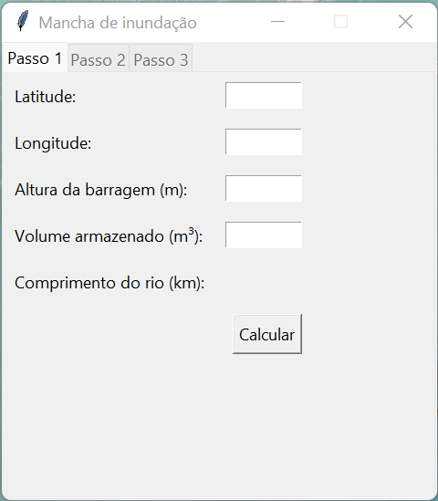
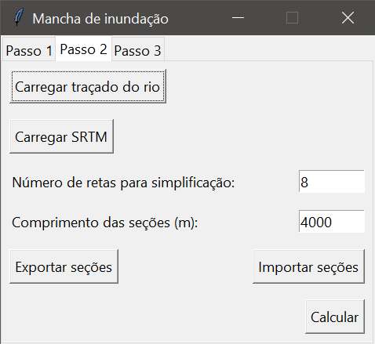
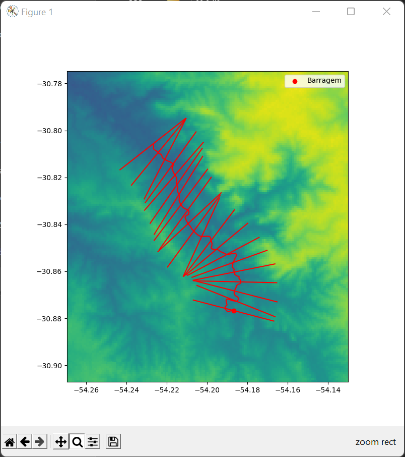
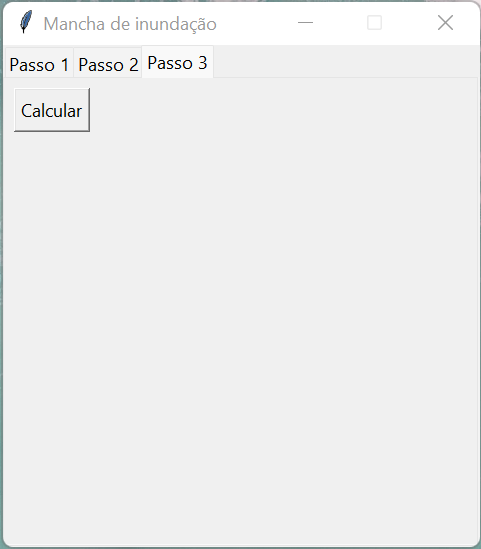
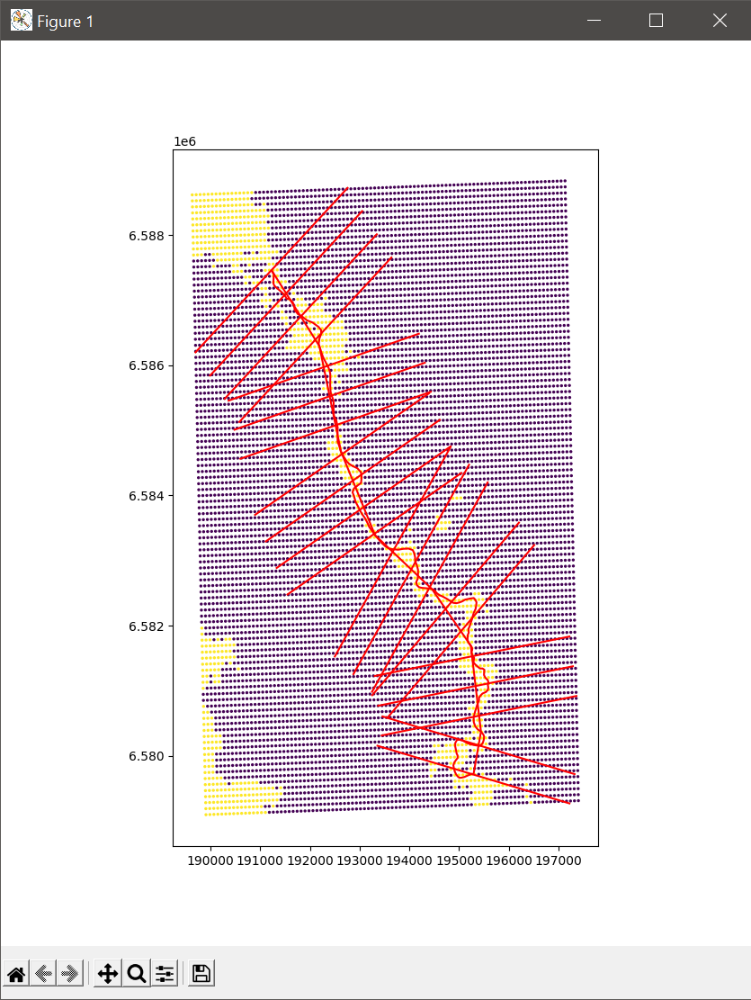
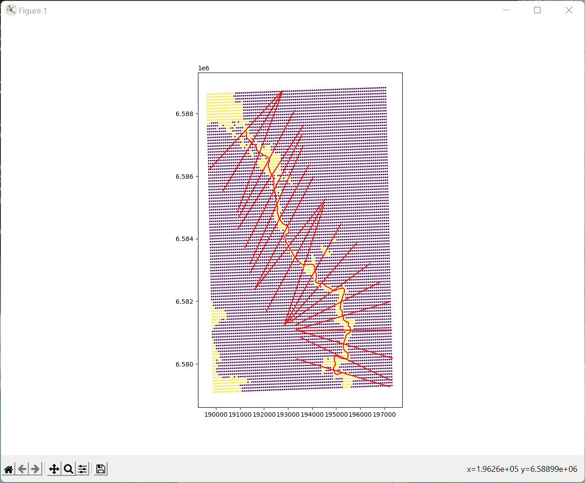
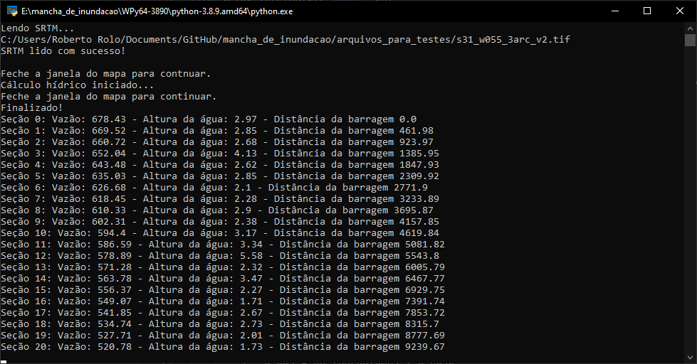

# Mancha de Inundação

Implementação em python da metodologia simplificada para definição da mancha de inundação em caso de rompimento de barragem desenvolvido em parceria da ANA com o LNEC.

## Referência

* [CLASSIFICAÇÃO DE BARRAGENS QUANTO AO DANO POTENCIAL ASSOCIADO: A EXPERIÊNCIA DA AGÊNCIA NACIONAL DE ÁGUAS](https://www.snisb.gov.br/Entenda_Mais/outros/artigo-para-o-dam-world-2018/classificacao-de-barragens-quanto-ao-seu-dano-potencial-associado-2018.docx)

## Dependeências

    pip install geopandas rasterio scipy simplekml matplotlib

## Execução

    python gui.py
  
## Passo 1

O passo um consiste em informar parâmtros básicos do barramento. O botão calcular retorna o comprimento do trecho do rio que deve ser traçado a partir do barramento. O traçado pode ser feito no Google Earth ou algum outro software GIS.

## Passo 2

No passo dois o traçado do rio deve ser carregado em formato `.kml`. Um SRTM, que pode ser baixado em https://earthexplorer.usgs.gov/, também deve ser carregado. 

O número de retas para simplificação do traçado do rio e o comprimento das seções perpendiculares devem ser informadas.

O botão calcular mostra as seções perpendiculares, o traçado e o srtm. Caso o usuário não esteja satisfeito com o resultado é possível exportar um arquivo `.shp`. As seções podem ser giradas em torno do traçado para evitar cruzamntos. O novo arquivo `.shp` deve ser anexado e o cálculo feito novamente.

A opção desinterceptar seções gera seção que não se interceptam, entretanto, o processo pode ser demorado.

## Passo 3

No passo três os cálculos hidráulicos são feitos sem a interação do usuário. Algumas simplificações e adaptações em relação à metodologia originalmente proposta foram necessárias para agilizar e tornar o fluxo de trabalho mais eficiente.

O programa mostra um mapa da mancha de inundação para conferência e salva um conjunto de pontos alagados em formato `.kml` que pode ser visualizado no Google Earth.

A janela do terminal mostra um sumário dos resultados.

