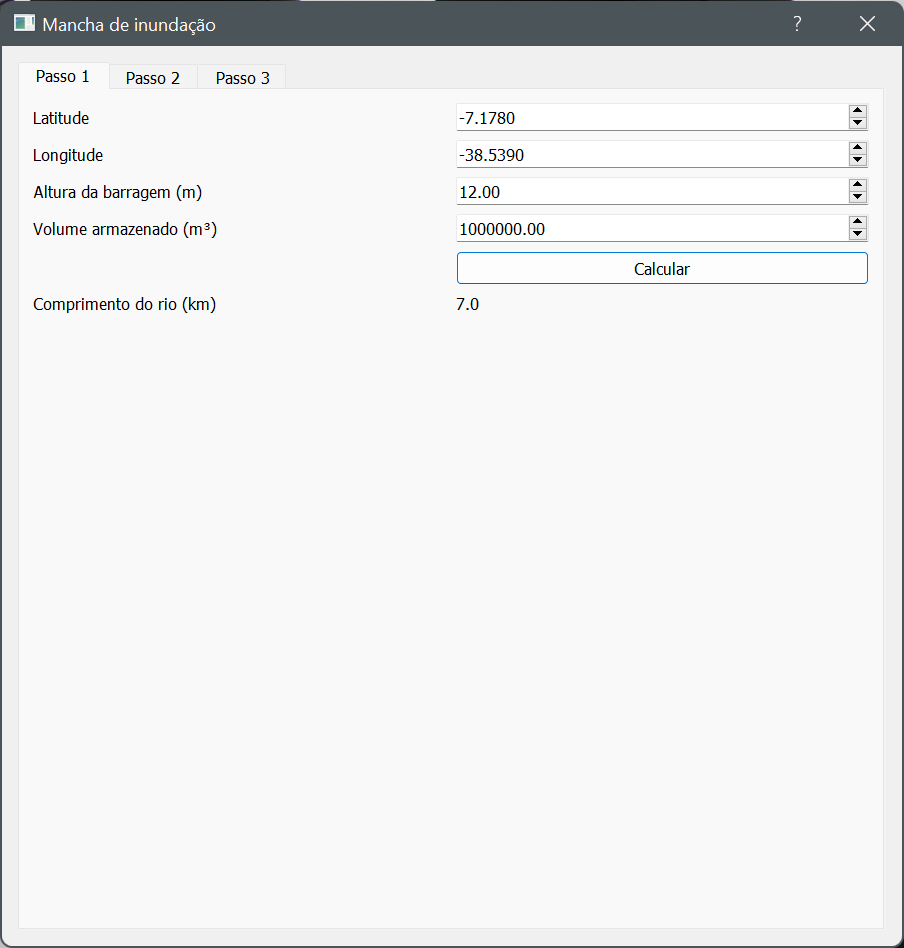
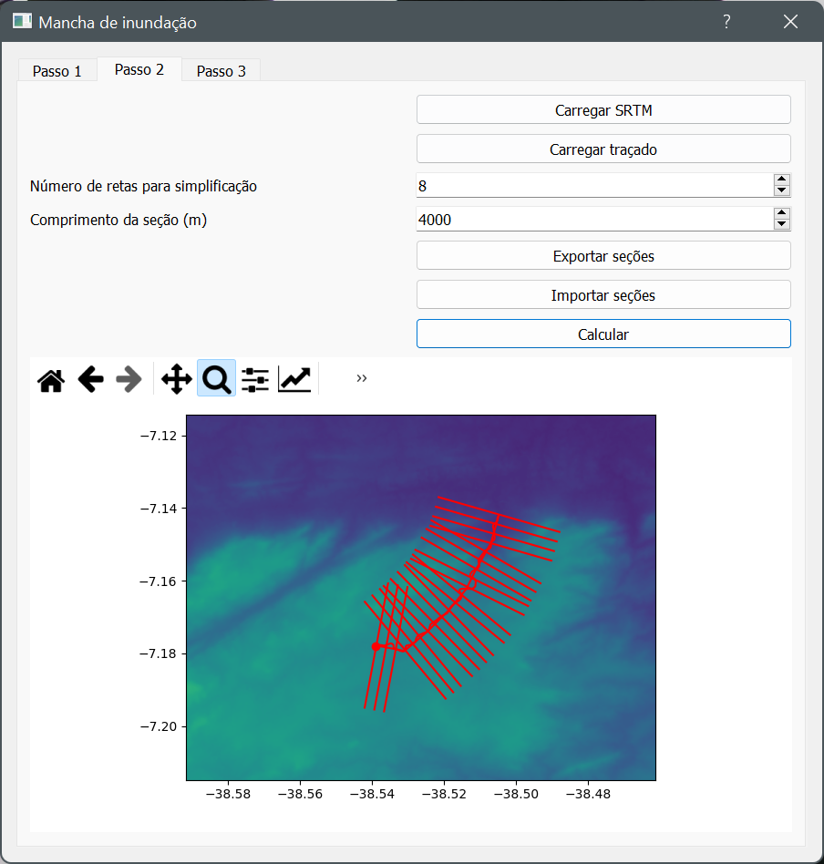
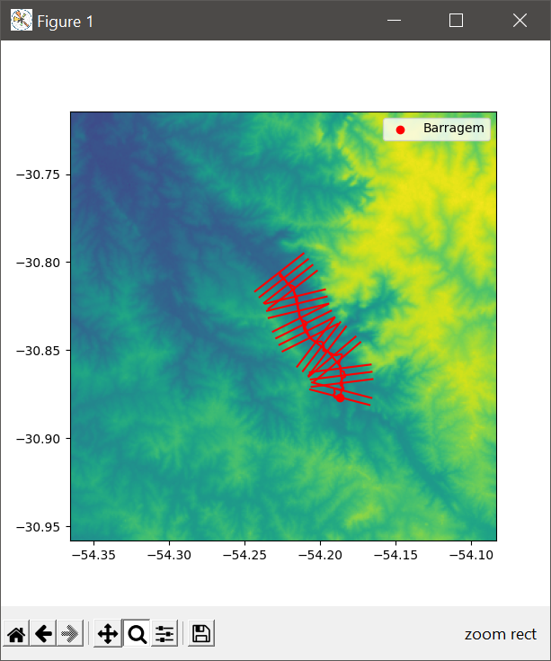
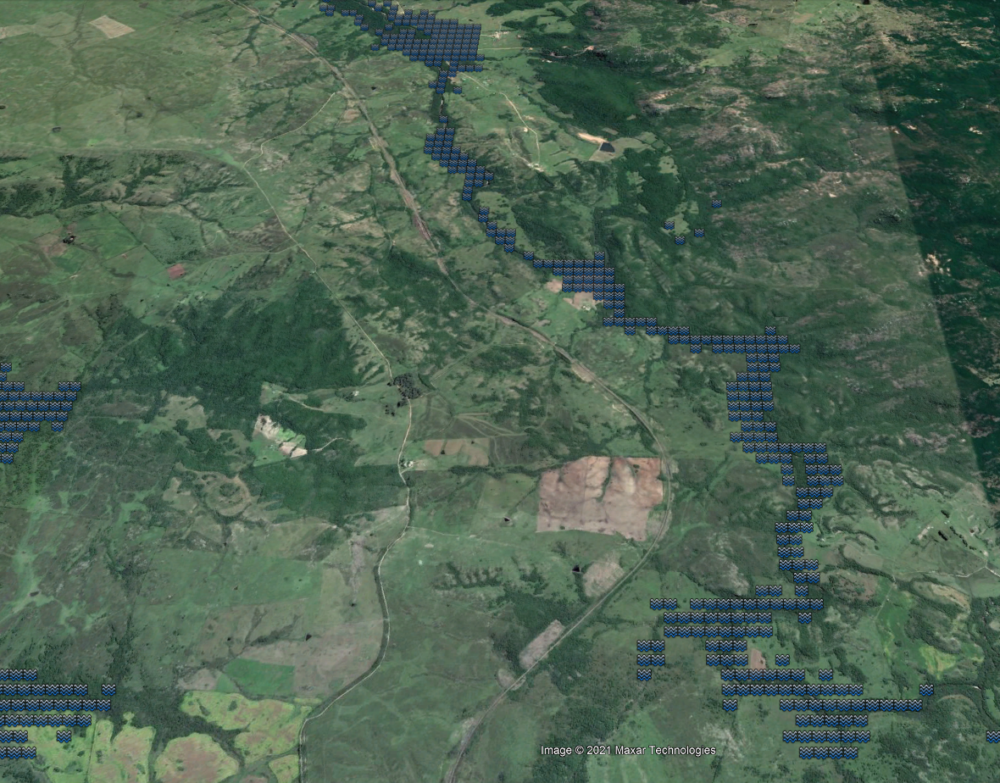

# Mancha de Inundação

## Dependeências

    pip install numpy geopandas rasterio scipy simplekml matplotlib
  
## Passo 1

O passo um consiste em informar parâmtros básicos do barramento. O botão calcular retorna o comprimento do trecho do rio que deve ser traçado a partir do barramento. 

## Passo 2

No passo dois o traçado do rio deve ser carregado. Um SRTM, pode ser baixado em https://earthexplorer.usgs.gov/, também deve ser carregado. O número de de retas para simplificação do traçado do rio e o comprimento das seções perpendiculares devem ser informadas.

O botão calcular mostra as seções perpendiculares, o traçado e srtm. Caso o usuário não esteja satisfeito com o resultado é possível exportar um arquivo `.shp`. As seções podem ser giradas em torno do traçado para evitar cruzamntos. O novo arquivo `.shp` deve ser anexado e o cálculo feito novamente.

## Passo 3

No passo três o restante dos cálculos é feito. O programa mostra um mapa da mancha de inundação e salva um conjunto de pontos alagados em formato `.kml` que pode ser visualizado no google earth.

